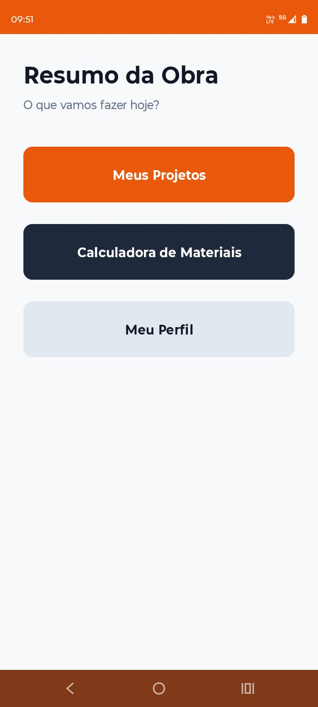
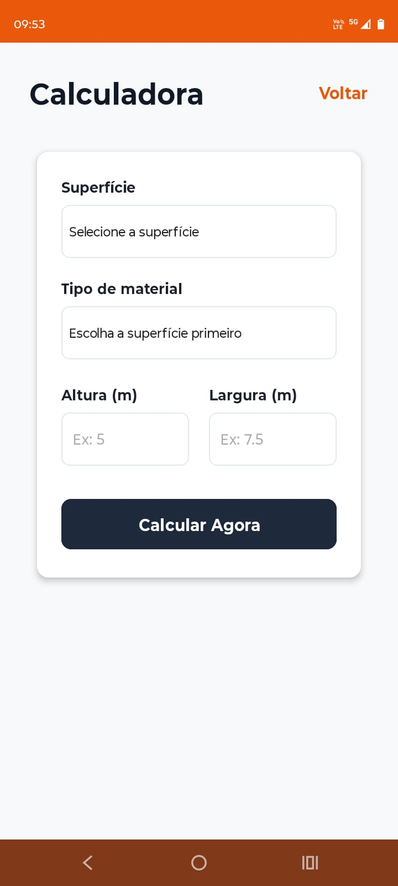

# 🏗️ Obra Certa - App Mobile

O **Obra Certa** é um aplicativo Android desenvolvido para auxiliar profissionais da construção civil no gerenciamento de seus projetos, cálculo de materiais e acompanhamento de tarefas diárias.

Este repositório contém o código-fonte do aplicativo mobile (Frontend), construído de forma nativa utilizando a linguagem recomendada pelo Google para o ecossistema mobile.

## 📱 Telas do Sistema

  
  
  

## 🚀 Funcionalidades Atuais

* **Sistema de Navegação:** Fluxo completo de telas (Activities) utilizando `Intents` nativos do Android.
* **Menu Central (Home):** Hub de acesso rápido para todas as ferramentas do aplicativo.
* **Calculadora de Materiais:** * Cálculo dinâmico de área (m²) com base em altura e largura.
  * Inclusão automática da margem de segurança de 10% (perda de material), padrão na construção civil.
  * Tratamento de erros para campos vazios e exibição de resultados via interface oculta (`View.GONE` / `View.VISIBLE`).
* **Gerenciador de Tarefas:** * Captura de texto dinâmico para criação de checklist por projeto.
  * Lógica interativa de CheckBoxes com efeito visual de texto riscado (`strikethrough`) para tarefas concluídas.
* **Padronização Visual:** Dicionários centralizados de `colors.xml` e `strings.xml`, com o aplicativo forçado para o tema Claro (Light Mode) visando consistência em diferentes dispositivos.

## 🛠️ Tecnologias Utilizadas

* **Linguagem:** Kotlin
* **IDE:** Android Studio
* **Interface (UI):** XML (Views tradicionais)
* **Gerenciamento de Dependências:** Gradle
* **Controle de Versão:** Git & GitHub

## 📂 Estrutura de Telas

O fluxo do aplicativo está dividido nas seguintes Activities:
1. `LoginActivity`: Porta de entrada e autenticação.
2. `HomeActivity`: Dashboard principal.
3. `ProjetoActivity`: Lista de clientes e obras ativas.
4. `TarefasActivity`: Checklist interativo atrelado aos projetos.
5. `CalculadoraActivity`: Ferramenta matemática de orçamentação.
6. `PerfilActivity`: Informações do usuário logado.
